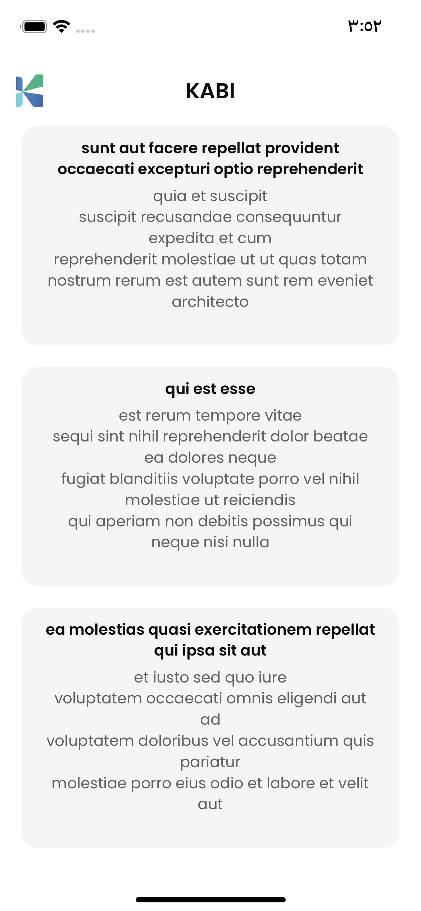
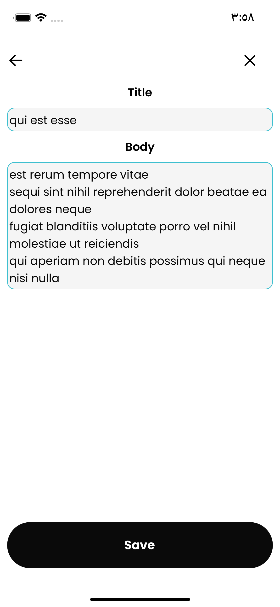

# KABI APP

A simple app that uses the [JSONPlaceholder](https://jsonplaceholder.typicode.com/posts) API to set up its pretty screens and display some fake posts.

#### Features

1. Responsive Screens:

- Built two screens that are optimized and responsive across all iOS and Android devices, ensuring a consistent user experience.
  2.Data Fetching and Storage:

- Utilized the useContext hook to fetch and store data, allowing for efficient management and access of app data.
- Edit title and body for post.

3. Font and Icon Integration:

- Implemented the popular Poppins font throughout the app to enhance the visual appeal and readability.
- Integrated relevant icons to improve the user interface and provide intuitive navigation.

4. Responsive Components:

- Developed various components tailored to enhance the responsiveness of the application.
- These components dynamically adjust to different screen sizes and orientations, optimizing the user experience.

### Getting Started

These instructions will get you a copy of the project up and running on
your local machine for development and testing purposes.

#### Prerequisites

Follow this [guide](https://reactnative.dev/docs/environment-setup).

- Yarn package manager
- Expo v.48
- Make sure you have an Android or iOS device with Expo Client installed. Also, you can use an Android or iOS emulator.

#### Installation

1. Clone this repository to your local machine:
   `git clone https://github.com/IbrahimTahayneh/kapiListApp.git`
2. Navigate to the project's directory:
   `cd kapiListApp`
3. Install the project dependencies:
   `yarn | yarn install | npm install`
4. Start project:
   `yarn ios | yarn start | yarn android`

#### Screenshots

 
 
 
 
 
 

